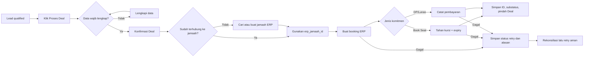

# Product Requirements Document — CRM WhatsApp Azhan

**Nama produk:** Azhan CRM  
**Status:** Draft untuk implementasi MVP  
**Versi:** 1.0  
**Tanggal:** 29 Agustus 2026  
**Pemilik produk:** Azhan Group  
**Sistem terkait:** ERP Azhan, Master Dashboard, Travel Dashboard, WhatsApp via Baileys

---

## 1. Ringkasan Produk

Azhan CRM adalah aplikasi CRM WhatsApp multi-brand untuk tim penjualan travel umrah. Produk menggabungkan inbox percakapan WhatsApp, pengelolaan lead berbentuk Kanban, profil calon jamaah, aktivitas follow-up, dan konversi lead menjadi booking di ERP Azhan.

Ketika percakapan baru masuk dari WhatsApp, sistem membuat atau menghubungkan kontak dan lead pada brand yang memiliki nomor WhatsApp tersebut. Tim sales dapat membalas percakapan, melengkapi data calon jamaah, memindahkan lead antar tahap, dan menandai lead sebagai **Deal**. Proses Deal akan membuat atau menghubungkan data jamaah di ERP, lalu membuat booking pada jadwal/paket yang dipilih. Pengguna memilih jenis komitmen **Book Seat**, **DP**, atau **Lunas**. Booking tersebut langsung tersedia pada Master Dashboard atau Travel Dashboard sesuai brand.

Referensi pengalaman pengguna adalah empat screenshot Pancake CRM di folder ini, terutama pola tiga panel untuk percakapan, Kanban lead, detail lead, dan dashboard performa. Produk tidak menyalin identitas visual, aset, atau merek Pancake.

---

## 2. Latar Belakang dan Masalah

Saat ini percakapan WhatsApp, data calon jamaah, tindak lanjut sales, serta data jamaah/booking berada pada alur yang terpisah. Kondisi ini menimbulkan beberapa masalah:

- Pesan calon jamaah berisiko terlambat dibalas atau tidak memiliki PIC.
- Riwayat percakapan dan status penjualan tidak terlihat dalam satu tempat.
- Data calon jamaah harus diketik ulang ketika transaksi disepakati.
- Tidak ada pipeline yang menunjukkan jumlah, usia, nilai, dan hambatan lead.
- Manajemen sulit mengukur respons, follow-up, konversi, dan sumber lead per brand.
- Proses manual berisiko membuat data jamaah atau booking ganda.

Azhan CRM menyatukan alur tersebut dan menjadikan ERP Azhan sebagai sumber kebenaran untuk brand, paket/jadwal, jamaah, dan booking.

---

## 3. Visi dan Sasaran

### 3.1 Visi

Membantu setiap tim travel Azhan mengubah percakapan WhatsApp menjadi keberangkatan jamaah melalui alur penjualan yang cepat, terukur, dan tanpa input data berulang.

### 3.2 Sasaran MVP

1. Menampilkan dan membalas percakapan WhatsApp secara real-time.
2. Otomatis membuat kontak, percakapan, dan lead dari pesan masuk baru.
3. Menyediakan pipeline Kanban yang mudah dipahami dan dioperasikan.
4. Menyediakan detail lead yang dapat dilihat dan diedit tanpa kehilangan konteks percakapan.
5. Mengambil brand dan jadwal/paket dari API ERP Azhan.
6. Mengonversi lead Deal menjadi jamaah dan booking ERP secara aman.
7. Memastikan seluruh data terisolasi berdasarkan brand/tenant.
8. Memberi visibilitas dasar terhadap performa inbox dan pipeline.

### 3.3 Indikator Keberhasilan

- Minimal 95% pesan masuk tampil di CRM dalam waktu tiga detik setelah diterima service WhatsApp.
- Tidak ada kebocoran data lintas brand pada pengujian otorisasi.
- Tidak ada booking ganda akibat retry pada satu proses Deal.
- Median waktu respons pertama dapat diukur per brand dan per PIC.
- Minimal 90% lead Deal memiliki jadwal, tipe kamar, nama, dan nomor WhatsApp yang valid.
- Pengguna dapat menyelesaikan alur buka pesan → lengkapi lead → Deal tanpa berpindah aplikasi.

---

## 4. Ruang Lingkup

### 4.1 Termasuk dalam MVP

- Login menggunakan akun admin ERP Azhan.
- Pemilihan brand untuk Super Admin dan scope otomatis untuk admin Travel.
- Koneksi satu akun WhatsApp aktif per brand melalui QR code Baileys.
- Status koneksi WhatsApp dan mekanisme reconnect.
- Inbox conversation dengan pencarian, filter, unread count, dan assignment PIC.
- Pengiriman dan penerimaan pesan teks serta gambar/dokumen dasar.
- Pembuatan kontak dan lead otomatis dari percakapan pertama.
- Pipeline Kanban dan perpindahan tahap menggunakan drag-and-drop atau aksi keyboard.
- Detail dan edit lead.
- Catatan internal dan riwayat aktivitas.
- Sinkronisasi daftar jadwal/paket dari ERP.
- Konversi Deal menjadi jamaah dan booking ERP.
- Tautan langsung ke detail jamaah/booking di dashboard ERP.
- Dashboard ringkas untuk volume lead, unread, Deal, conversion rate, dan response time.
- Audit log untuk aksi penting.

### 4.2 Di luar MVP

- Broadcast massal, blast promosi, atau pengiriman pesan tanpa persetujuan penerima.
- Bot AI/autoreply generatif.
- Voice call, video call, dan status WhatsApp.
- Omnichannel selain WhatsApp.
- Campaign builder dan marketing automation kompleks.
- Komisi sales, invoice, pembayaran, dokumen keberangkatan, atau operasional setelah booking; fungsi tersebut tetap dikelola ERP.
- Penggantian Master Dashboard atau Travel Dashboard.
- Aplikasi mobile native.
- Multi-account WhatsApp dalam satu brand. Kemampuan ini dapat masuk fase berikutnya.

---

## 5. Asumsi dan Keputusan Produk

1. “Baylies” pada permintaan produk merujuk pada library **Baileys** dari WhiskeySockets.
2. CRM berjalan sebagai aplikasi dan service terpisah dari ERP, tetapi memakai API ERP sebagai integrasi resmi.
3. ERP tetap menjadi sumber kebenaran untuk akun admin, brand, jadwal, jamaah, dan booking.
4. CRM menjadi sumber kebenaran untuk sesi WhatsApp, percakapan, pesan, lead, pipeline, tag, catatan, assignment, dan aktivitas sales.
5. Admin Travel hanya boleh melihat data brand pada token ERP miliknya.
6. Super Admin wajib memilih konteks brand sebelum membuka inbox, pipeline, atau menghubungkan WhatsApp.
7. Tahap Deal/Won bukan sekadar perubahan kolom. Tahap ini hanya dinyatakan berhasil setelah booking ERP berhasil dibuat atau booking yang sudah ada berhasil dihubungkan, serta jenis komitmen yang dipilih berhasil dicatat.
8. Nomor WhatsApp dinormalisasi ke format E.164 untuk pencarian dan deduplikasi.
9. Satu kontak dapat memiliki beberapa lead sepanjang waktu, tetapi satu percakapan aktif hanya memiliki satu lead aktif default.
10. Semua waktu disimpan dalam UTC dan ditampilkan dalam zona waktu pengguna; default operasional adalah `Asia/Jakarta`.

---

## 6. Persona dan Hak Akses

| Persona | Kebutuhan utama | Hak akses MVP |
|---|---|---|
| Super Admin Azhan | Memantau dan membantu seluruh brand | Memilih brand, melihat CRM per brand, mengelola konfigurasi global; tidak boleh mencampur data antar-brand dalam satu konteks |
| Owner/Manager Travel (Admin CRM) | Memantau pipeline dan performa tim | Melihat seluruh conversation/lead brand, membuat dan menonaktifkan akun CS, mengatur jatah lead, melihat leaderboard, edit pipeline, Deal/Lost |
| Sales/PIC (CS) | Menangani percakapan dan follow-up | Hanya melihat lead dan percakapan yang ditugaskan, membalas pesan, edit lead, pindah tahap, serta memproses Deal |
| Auditor/Viewer (fase berikutnya) | Membaca histori tanpa mengubah data | Read-only conversation, lead, aktivitas, dan metrik |

Catatan: ERP menyimpan role `admin` atau `cs` pada akun brand. CRM memetakan `admin` ke Manager dan `cs` ke Sales, sedangkan Super Admin tetap wajib memilih konteks brand. Akun CS tidak mendapat akses ke menu administrasi ERP selain endpoint operasional CRM yang diizinkan.

---

## 7. Arsitektur Informasi

### 7.1 Navigasi Utama

- **Ringkasan** — metrik inbox dan pipeline.
- **Percakapan** — inbox WhatsApp dan detail kontak.
- **Pipeline** — Kanban lead.
- **Kontak** — daftar kontak CRM dan hubungan ke jamaah ERP.
- **Aktivitas** — follow-up, catatan, dan audit aktivitas.
- **Pengaturan**
  - Koneksi WhatsApp
  - Pipeline dan tahapan
  - Tag
  - Anggota/PIC
  - Integrasi ERP

### 7.2 Rute yang Disarankan

| Rute | Tujuan |
|---|---|
| `/login` | Login menggunakan kredensial ERP |
| `/select-brand` | Memilih konteks brand bagi Super Admin |
| `/` | Dashboard ringkas |
| `/conversations` | Inbox percakapan |
| `/conversations/:id` | Percakapan terpilih dan profil ringkas |
| `/pipeline` | Kanban lead |
| `/leads/:id` | Detail lead lengkap |
| `/contacts` | Daftar kontak |
| `/contacts/:id` | Detail kontak dan histori lead |
| `/activities` | Daftar follow-up dan aktivitas |
| `/settings/whatsapp` | QR, status, reconnect, dan logout perangkat |
| `/settings/pipeline` | Konfigurasi tahapan dan SLA |

---

## 8. Alur Pengguna Utama

### 8.1 Pesan Masuk Menjadi Lead

1. Baileys menerima event pesan untuk sesi WhatsApp sebuah brand.
2. Service memvalidasi jenis chat, mengabaikan status broadcast, dan menerapkan kebijakan grup.
3. Sistem menormalisasi JID/nomor telepon dan mencari kontak pada brand tersebut.
4. Jika kontak belum ada, sistem membuat kontak baru.
5. Sistem mencari percakapan aktif; jika belum ada, sistem membuat percakapan.
6. Jika kontak tidak memiliki lead aktif, sistem membuat lead di tahap **Baru**.
7. Pesan disimpan secara idempotent berdasarkan ID pesan WhatsApp.
8. Inbox diperbarui secara real-time dan unread count bertambah jika percakapan tidak sedang dibuka.
9. Sistem mencatat aktivitas `message_received`.

### 8.2 Menangani Percakapan

1. Sales membuka menu Percakapan.
2. Sales mencari/filter percakapan berdasarkan unread, PIC, tag, tahap, atau waktu.
3. Sales memilih percakapan dan membaca riwayat pesan.
4. Panel kanan menampilkan identitas dan ringkasan lead tanpa meninggalkan inbox.
5. Sales dapat mengubah nama, tag, PIC, tahap, rencana keberangkatan, paket diminati, jumlah pax, dan catatan.
6. Sales mengirim pesan; UI menampilkan status mengirim, terkirim, gagal, dan opsi retry.
7. Membuka percakapan menandai pesan sebagai dibaca di CRM. Read receipt WhatsApp mengikuti konfigurasi privasi produk.

### 8.3 Mengelola Pipeline

1. Sales membuka Pipeline.
2. Sistem menampilkan kolom tahapan dan jumlah/nilai lead.
3. Lead dapat dipindah dengan drag-and-drop maupun menu “Pindah tahap” yang ramah keyboard.
4. Perpindahan tahap disimpan optimistically, lalu dikembalikan jika server gagal.
5. Membuka kartu menampilkan detail tanpa kehilangan posisi scroll Kanban.
6. Tahap Lost mewajibkan alasan kehilangan.
7. Tahap Deal/Won membuka proses konversi, bukan langsung memindahkan kartu.

### 8.4 Deal Menjadi Booking ERP

1. Pengguna menekan **Proses Deal** pada detail lead.
2. Sistem melakukan preflight dan meminta data wajib:
   - nama lengkap;
   - nomor WhatsApp;
   - brand;
   - jadwal/paket ERP;
   - tipe kamar: `Quad`, `Triple`, atau `Double`;
   - jumlah pax;
   - harga sesuai jadwal atau override jika pengguna berwenang;
   - jenis komitmen: `book_seat`, `dp`, atau `lunas`;
   - batas waktu penahanan kursi jika memilih Book Seat;
   - nominal, metode, tanggal, dan bukti pembayaran jika memilih DP/Lunas.
3. UI menampilkan ringkasan final dan dampaknya: data jamaah dan booking akan dibuat di ERP.
4. Setelah konfirmasi, server membuat record konversi dengan `idempotency_key` unik untuk lead.
5. Jika `erp_jamaah_id` sudah terhubung, server menggunakannya. Jika belum:
   - server mencari kandidat jamaah berdasarkan nomor telepon yang dinormalisasi;
   - jika ada lebih dari satu kandidat atau kecocokan meragukan, pengguna wajib memilih;
   - jika tidak ada, server memanggil `POST /api/admin/jamaah`.
6. Server memanggil `POST /api/admin/bookings` dengan `schedule_id`, `jamaah_id`, dan `room_type`.
7. Server menjalankan aksi sesuai jenis komitmen:
   - **Book Seat:** menahan satu kursi secara atomik, menyimpan `is_seat_blocked=true`, serta mencatat `seat_hold_expires_at`. Booking boleh tetap berstatus `baru`, tetapi badge CRM adalah **Book Seat**.
   - **DP:** membuat payment ERP. Jika pembayaran masih menunggu verifikasi, badge CRM adalah **DP Menunggu Verifikasi**. Setelah payment dikonfirmasi, booking berubah menjadi `dp` dan kursi terkunci.
   - **Lunas:** membuat dan mengonfirmasi payment penuh sesuai kewenangan; booking berubah menjadi `lunas` dan kursi terkunci.
8. Setelah ERP mengembalikan hasil, server menyimpan `erp_jamaah_id`, `erp_booking_id`, optional `erp_payment_id`, jenis komitmen, snapshot data Deal, dan status konversi `completed`.
9. Lead baru dipindahkan ke tahap **Deal** dan menampilkan substatus Book Seat, DP Menunggu, DP Terkonfirmasi, atau Lunas.
10. UI menampilkan sukses dan tautan **Lihat booking di ERP**.
11. Jika langkah sebelumnya berhasil tetapi aksi berikutnya gagal, status menjadi `requires_retry`; retry melanjutkan dari ID ERP yang sudah tersimpan dan tidak membuat data kedua.
12. Jika respons ERP tidak diketahui akibat timeout, sistem melakukan rekonsiliasi sebelum mencoba request create kembali.

Book Seat dan DP tidak boleh disamakan. Book Seat adalah reservasi kursi dengan masa berlaku tanpa bukti pembayaran, sedangkan DP adalah pembayaran yang tercatat dan dapat memerlukan verifikasi.

### 8.5 Alur Konversi



---

## 9. Kebutuhan Fungsional

### 9.1 Autentikasi dan Multi-Tenant

| ID | Kebutuhan | Prioritas |
|---|---|---|
| AUTH-01 | Pengguna login menggunakan endpoint autentikasi ERP. | Must |
| AUTH-02 | Token/sesi kedaluwarsa dapat diperbarui tanpa kehilangan pekerjaan pengguna. | Must |
| AUTH-03 | `brand_id` wajib berasal dari identitas yang sudah diverifikasi, bukan body request bebas. | Must |
| AUTH-04 | Super Admin wajib memilih brand aktif dan server memvalidasi haknya. | Must |
| AUTH-05 | Semua query CRM wajib difilter berdasarkan brand aktif. | Must |
| AUTH-06 | Pergantian brand membersihkan cache UI, room real-time, dan data sensitif brand sebelumnya. | Must |

### 9.2 Koneksi WhatsApp

| ID | Kebutuhan | Prioritas |
|---|---|---|
| WA-01 | Admin dapat membuat koneksi melalui QR code yang memiliki masa berlaku. | Must |
| WA-02 | UI menampilkan status `disconnected`, `connecting`, `qr_required`, `connected`, `reconnecting`, atau `logged_out`. | Must |
| WA-03 | Kredensial dan Signal keys Baileys tersimpan aman serta tidak masuk Git/log. | Must |
| WA-04 | Service melakukan reconnect dengan exponential backoff kecuali perangkat logout. | Must |
| WA-05 | Admin dapat logout perangkat setelah dialog konfirmasi. | Must |
| WA-06 | Pesan masuk/keluar disimpan idempotent. | Must |
| WA-07 | Sistem mendukung teks, gambar, dan dokumen pada MVP. | Should |
| WA-08 | Status pengiriman tampil sebagai pending, sent, delivered, read, atau failed jika event tersedia. | Should |
| WA-09 | Sistem tidak menyediakan blast atau pengiriman pesan massal pada MVP. | Must |

### 9.3 Percakapan

| ID | Kebutuhan | Prioritas |
|---|---|---|
| CONV-01 | Daftar conversation diurutkan berdasarkan pesan terakhir. | Must |
| CONV-02 | Setiap item menampilkan nama/nomor, preview pesan, waktu, unread, PIC, dan tag penting. | Must |
| CONV-03 | Pengguna dapat mencari nama, nomor, dan isi pesan yang diindeks. | Must |
| CONV-04 | Pengguna dapat filter berdasarkan unread, PIC, tahap, tag, dan rentang waktu. | Must |
| CONV-05 | Pengguna dapat membaca riwayat dan mengirim balasan. | Must |
| CONV-06 | Panel profil ringkas dapat diedit tanpa menutup percakapan. | Must |
| CONV-07 | Pesan gagal dapat dicoba ulang tanpa menggandakan pesan yang sudah berhasil. | Must |
| CONV-08 | Empty, loading, offline, disconnected, dan error state harus eksplisit. | Must |

### 9.4 Lead dan Kanban

| ID | Kebutuhan | Prioritas |
|---|---|---|
| LEAD-01 | Pesan baru dari kontak tanpa lead aktif membuat lead di tahap Baru. | Must |
| LEAD-02 | Tahap default: Baru, Dihubungi, Follow Up, Qualified, Negosiasi, Deal, Lost. | Must |
| LEAD-03 | Manager dapat mengatur nama, warna, urutan, dan SLA tahap selain tahap sistem Deal/Lost. | Should |
| LEAD-04 | Kartu menampilkan nama, nomor tersamarkan sebagian, paket/rencana, PIC, tag, umur tahap, unread, dan estimasi nilai. | Must |
| LEAD-05 | Lead dapat dipindahkan dengan drag-and-drop dan alternatif keyboard/menu. | Must |
| LEAD-06 | Pengguna dapat melihat dan mengedit detail lead. | Must |
| LEAD-07 | Setiap perubahan penting dicatat dalam timeline aktivitas. | Must |
| LEAD-08 | Memindahkan ke Lost mewajibkan alasan. | Must |
| LEAD-09 | Memindahkan ke Deal wajib melewati conversion flow. | Must |
| LEAD-10 | Filter Kanban mendukung PIC, tag, paket, tanggal, tahap, dan status unread. | Should |

### 9.5 Data Lead

Detail lead minimal mencakup:

- Nama calon jamaah.
- Nomor WhatsApp dan JID teknis.
- Email.
- Kota/domisili.
- Sumber lead/iklan.
- PIC/assignee.
- Tag.
- Rencana bulan/tanggal keberangkatan.
- Jadwal/paket ERP yang diminati.
- Tipe kamar.
- Jumlah pax.
- Estimasi nilai transaksi.
- Catatan.
- Tahap dan alasan Lost.
- Tanggal follow-up berikutnya.
- Relasi `erp_jamaah_id` dan `erp_booking_id`.
- Conversation dan aktivitas terkait.

Validasi harus menggunakan pesan yang spesifik dan tidak menghapus nilai form ketika penyimpanan gagal.

### 9.6 Integrasi ERP dan Deal

| ID | Kebutuhan | Prioritas |
|---|---|---|
| ERP-01 | CRM memakai login dan refresh token ERP. | Must |
| ERP-02 | CRM mengambil konteks brand dari ERP. | Must |
| ERP-03 | Pilihan paket Deal berasal dari `GET /api/admin/schedules`. | Must |
| ERP-04 | CRM dapat menghubungkan lead ke jamaah ERP yang sudah ada. | Must |
| ERP-05 | CRM dapat membuat jamaah melalui `POST /api/admin/jamaah`. | Must |
| ERP-06 | CRM dapat membuat booking melalui `POST /api/admin/bookings`. | Must |
| ERP-07 | Konversi Deal wajib idempotent dan memiliki status yang dapat direkonsiliasi. | Must |
| ERP-08 | Tahap Deal hanya berubah setelah booking berhasil dan ID tersimpan. | Must |
| ERP-09 | Error ERP ditampilkan dalam bahasa yang bisa ditindaklanjuti, tanpa mengekspos stack trace. | Must |
| ERP-10 | Detail lead menyediakan deep link ke jamaah/booking sesuai jenis dashboard dan brand. | Should |
| ERP-11 | Deal mendukung pilihan Book Seat, DP, atau Lunas dan menyimpan substatusnya. | Must |
| ERP-12 | Book Seat mengurangi ketersediaan kursi secara atomik dan memiliki waktu kedaluwarsa. | Must |
| ERP-13 | DP/Lunas selalu memiliki record payment ERP; CRM tidak boleh sekadar mengubah status booking tanpa jejak pembayaran. | Must |
| ERP-14 | Payment pending, confirmed, atau rejected disinkronkan kembali ke substatus lead. | Must |

### 9.7 Dashboard dan Aktivitas

| ID | Kebutuhan | Prioritas |
|---|---|---|
| DASH-01 | Tampilkan lead baru, unread, Deal, Lost, dan conversion rate pada periode terpilih. | Must |
| DASH-02 | Tampilkan median waktu respons pertama dan jumlah lead melewati SLA. | Should |
| DASH-03 | Tampilkan distribusi lead per tahap dan sumber. | Should |
| DASH-04 | Metrik dapat difilter berdasarkan hari ini, minggu ini, bulan ini, atau rentang khusus. | Should |
| AUDIT-01 | Catat perubahan tahap, assignment, edit data penting, pesan keluar, koneksi WA, dan Deal. | Must |

### 9.8 Tim CS dan Distribusi Lead

| ID | Kebutuhan | Prioritas |
|---|---|---|
| TEAM-01 | Admin CRM dapat membuat, mengubah, menonaktifkan, dan mereset password akun CS hanya pada brand aktifnya. | Must |
| TEAM-02 | Admin mengatur jatah bilangan bulat per CS aktif dengan total tepat 100%. | Must |
| TEAM-03 | Lead inbound dibagikan bergiliran dan setiap CS dilewati setelah kuota siklusnya habis. | Must |
| TEAM-04 | Perubahan jatah memulai siklus baru tanpa memindahkan assignment lead lama. | Must |
| TEAM-05 | Admin melihat leaderboard Deal, lead aktif, conversion rate, dan nilai pipeline per CS/periode. | Must |
| TEAM-06 | CS hanya dapat mengakses lead, percakapan, pesan, dashboard, dan aktivitas yang ditugaskan kepadanya. | Must |

---

## 10. Integrasi API ERP yang Tersedia

Base URL lokal default: `http://localhost:9090`.

| Kebutuhan CRM | Endpoint ERP saat ini | Catatan |
|---|---|---|
| Login | `POST /api/auth/login` | Payload: `email`, `password` |
| Refresh | `POST /api/auth/refresh` | Payload: `refresh_token` |
| Logout | `POST /api/auth/logout` | Gunakan saat sesi CRM berakhir |
| Brand admin Travel | `GET /api/admin/my-brand` | Mengembalikan id, name, logo, primary color |
| Daftar brand Super Admin | `GET /api/admin/brands` | Hanya Super Admin |
| Daftar/membuat akun CS | `GET/POST /api/admin/crm/users` | Admin brand atau Super Admin dengan brand aktif |
| Mengubah akun/password CS | `PUT /api/admin/crm/users/{id}` dan `PUT /api/admin/crm/users/{id}/password` | Selalu difilter `brand_id` dan role `cs` |
| Daftar jadwal | `GET /api/admin/schedules` | Dapat difilter status; server harus menjaga scope brand |
| Daftar/cari kandidat jamaah | `GET /api/admin/jamaah` | MVP melakukan pencocokan nomor di CRM; endpoint pencarian server-side direkomendasikan |
| Detail jamaah | `GET /api/admin/jamaah/{id}` | Untuk verifikasi relasi |
| Membuat jamaah | `POST /api/admin/jamaah` | `nama_lengkap` wajib; Super Admin juga wajib mengirim `brand_id` |
| Memperbarui jamaah | `PUT /api/admin/jamaah/{id}` | Jangan menimpa data lengkap dengan nilai kosong tanpa konfirmasi |
| Membuat booking | `POST /api/admin/bookings` | Payload: `schedule_id`, `jamaah_id`, `room_type`, opsional `total_harga` |
| Detail booking | `GET /api/admin/bookings/{id}` | Untuk rekonsiliasi dan deep link |
| Membuat payment | `POST /api/admin/bookings/{booking_id}/payments` | Status awal selalu `pending` |
| Verifikasi payment | `PUT /api/admin/payments/{id}/status` | Status `confirmed` atau `rejected` |
| Mengubah status booking | `PUT /api/admin/bookings/{id}/status` | Mendukung `baru`, `dp`, `lunas`, `batal`; jangan dipakai CRM untuk memalsukan DP tanpa payment |
| Melepas blok kursi | `DELETE /api/admin/bookings/{id}/seat-block` | Endpoint pelepasan sudah tersedia |

### 10.1 Payload Deal ke ERP

Contoh pembuatan jamaah:

```json
{
  "brand_id": 12,
  "nama_lengkap": "Nama calon jamaah",
  "no_hp": "+6281234567890",
  "email": "nama@example.com",
  "alamat": "Jakarta"
}
```

`brand_id` hanya dikirim ketika akun yang digunakan adalah Super Admin. Untuk admin Travel, server ERP menentukan brand dari token.

Contoh pembuatan booking:

```json
{
  "schedule_id": 88,
  "jamaah_id": 1204,
  "room_type": "Quad"
}
```

Nilai `room_type` harus tepat `Quad`, `Triple`, atau `Double`. Jika `total_harga` tidak dikirim, ERP mengambil snapshot harga dari jadwal.

Contoh pencatatan DP setelah booking dibuat:

```json
{
  "jumlah": 5000000,
  "metode": "transfer",
  "tanggal": "2026-08-29",
  "bukti_url": "https://storage.example.com/payment-proof.jpg",
  "source": "crm"
}
```

Payment baru berstatus `pending`. Booking menjadi `dp` setelah payment dikonfirmasi. Konfirmasi otomatis hanya boleh dilakukan untuk metode dan role yang secara bisnis memang berwenang.

### 10.2 Endpoint ERP yang Direkomendasikan

ERP saat ini belum memiliki endpoint untuk membuat blok kursi tanpa DP. Endpoint berikut wajib ditambahkan agar fitur Book Seat tidak memalsukan status pembayaran:

```http
PUT /api/admin/bookings/{id}/seat-block
Idempotency-Key: <uuid>
Content-Type: application/json

{
  "expires_at": "2026-08-31T10:00:00+07:00"
}
```

Endpoint harus mengunci row jadwal, memastikan `seat_sisa > 0`, mengurangi seat tepat satu kali, mengatur `is_seat_blocked=true`, serta menyimpan waktu kedaluwarsa. Job expiry wajib melepas kursi secara idempotent jika belum berubah menjadi DP/Lunas.

Untuk produksi, juga direkomendasikan endpoint atomik/idempotent berikut pada ERP:

```http
POST /api/admin/crm/deals
Idempotency-Key: <uuid>
```

Endpoint tersebut sebaiknya melakukan pencarian/pembuatan jamaah, pembuatan booking, dan aksi Book Seat/DP/Lunas dalam satu transaksi ERP. Sampai endpoint tersedia, CRM Orchestrator boleh memakai endpoint yang ada, tetapi wajib menyimpan state konversi dan melakukan rekonsiliasi sebelum retry.

### 10.3 Gap Backend ERP Saat Ini

Hasil review kode ERP pada 29 Agustus 2026 menunjukkan:

- `POST /api/admin/bookings` selalu membuat booking berstatus `baru` dan belum mengurangi seat.
- Perubahan booking `baru → dp/lunas` melalui endpoint status mengurangi seat dan mengatur `is_seat_blocked=true`.
- Konfirmasi payment dapat mengubah booking menjadi `dp/lunas` dan mengurangi seat, tetapi jalur payment saat ini perlu diperbaiki agar juga mengatur `is_seat_blocked=true` secara konsisten.
- Endpoint `DELETE /api/admin/bookings/{id}/seat-block` sudah ada untuk melepas blok.
- Endpoint untuk membuat blok kursi tanpa DP dan field `seat_hold_expires_at` belum ada.

Karena itu fitur Book Seat belum boleh dianggap selesai hanya dari sisi CRM. Perubahan ERP, migration expiry, job pelepasan hold, dan concurrency test merupakan bagian wajib implementasi fitur ini.

---

## 11. Model Data Konseptual

Semua tabel CRM yang mengandung data bisnis wajib memiliki `brand_id` dan indeks yang mendukung scope tenant.

| Entitas | Fungsi dan field penting |
|---|---|
| `crm_wa_sessions` | Brand, status, nomor terhubung, auth reference, waktu koneksi, last error |
| `crm_contacts` | Brand, JID, nomor normalized, nama, email, domisili, sumber, `erp_jamaah_id` |
| `crm_conversations` | Brand, contact, session, assigned user, unread count, last message, status |
| `crm_messages` | Conversation, WA message ID, arah, tipe, body/media, status, timestamp, reply reference |
| `crm_pipelines` | Brand, nama pipeline, default flag |
| `crm_stages` | Pipeline, nama, slug, warna, posisi, SLA, flag Won/Lost |
| `crm_leads` | Brand, contact, pipeline/stage, PIC, schedule, room type, pax, nilai, next follow-up, relasi ERP |
| `crm_tags` | Brand, nama, warna |
| `crm_lead_tags` | Relasi lead-tag |
| `crm_notes` | Lead, pembuat, catatan, timestamp |
| `crm_activities` | Actor, entity, action, before/after terpilih, timestamp |
| `crm_deal_conversions` | Lead unik, idempotency key, jenis komitmen, jamaah ID, booking ID, payment ID, status, attempt, error, snapshot payload |
| `crm_user_roles` | Admin ERP, brand, role CRM bila granular RBAC diterapkan |

### 11.1 Aturan Integritas

- Kombinasi `brand_id + whatsapp_jid` unik pada kontak.
- `wa_message_id` unik dalam ruang sesi/brand.
- Satu lead hanya boleh memiliki satu konversi Deal aktif.
- `erp_booking_id` unik bila tidak null.
- Tahap dan pipeline lead wajib berasal dari brand yang sama.
- Assignment PIC wajib merupakan user yang berhak pada brand tersebut.
- Penghapusan data operasional menggunakan soft delete bila dibutuhkan untuk audit.

---

## 12. Spesifikasi UI/UX

### 12.1 Prinsip Desain

1. **Conversation first:** percakapan dan konteks lead terlihat bersamaan.
2. **Progressive disclosure:** tampilkan field penting terlebih dahulu; data lanjutan tersedia pada detail.
3. **Status tidak bergantung pada warna:** selalu sertakan label/icon/teks.
4. **Satu aksi utama per konteks:** misalnya “Kirim” pada composer dan “Proses Deal” pada detail.
5. **Optimistic tetapi dapat dipulihkan:** drag-and-drop terasa cepat, namun error harus mengembalikan data dengan jelas.
6. **Multi-brand konsisten:** warna brand boleh menjadi accent, tetapi warna status sukses/peringatan/bahaya tetap semantik.
7. **Minim input ulang:** gunakan data conversation/lead untuk prefill Deal.

### 12.2 Shell Aplikasi Desktop

```text
┌──────────────┬─────────────────────────────────────────────────────────┐
│ Logo + Brand │ Top bar: search, WA status, notification, user          │
├──────────────┼─────────────────────────────────────────────────────────┤
│ Ringkasan    │                                                         │
│ Percakapan   │                 Konten halaman                          │
│ Pipeline     │                                                         │
│ Kontak       │                                                         │
│ Aktivitas    │                                                         │
│ Pengaturan   │                                                         │
└──────────────┴─────────────────────────────────────────────────────────┘
```

- Sidebar desktop: 248 px, dapat diciutkan.
- Top bar: 64 px, sticky.
- Lebar minimum desktop produktif: 1024 px.
- Pada tablet/mobile, sidebar menjadi drawer dan setiap panel conversation menjadi layar berurutan.

### 12.3 Layar Percakapan

```text
┌──────────────────────┬────────────────────────────┬──────────────────────┐
│ Search + Filter      │ Header kontak + aksi       │ Profil lead          │
│                      │                            │                      │
│ Daftar conversation  │ Riwayat pesan              │ Tahap + PIC           │
│ - avatar/nama        │                            │ Paket + rencana       │
│ - preview + waktu    │                            │ Tag + follow-up       │
│ - unread + PIC       │ Composer + attachment      │ Catatan / Deal        │
└──────────────────────┴────────────────────────────┴──────────────────────┘
```

- Panel daftar: 320–380 px.
- Panel profil: 320–380 px dan dapat diciutkan.
- Composer selalu terlihat di bagian bawah.
- Tombol kirim tidak aktif untuk pesan kosong.
- Enter mengirim dan Shift+Enter membuat baris baru; perilaku dijelaskan dekat composer.
- Pesan masuk dan keluar memiliki alignment, label waktu, dan status yang jelas.

### 12.4 Layar Pipeline

- Header berisi judul, total lead/nilai, search, filter, pilihan pipeline, dan tombol tambah lead.
- Kolom Kanban minimum 288 px dan dapat discroll horizontal.
- Header kolom sticky menampilkan nama, jumlah lead, total nilai, dan SLA alert.
- Kartu memiliki area klik detail dan handle drag yang jelas.
- Pengguna keyboard dapat membuka menu kartu lalu memilih tahap tujuan.
- Setelah drag sukses, live region mengumumkan perpindahan kepada screen reader.
- Filter aktif ditampilkan sebagai chips yang mudah dihapus.

### 12.5 Detail Lead

Tata letak desktop dua kolom:

- Kolom utama: ringkasan, data calon jamaah, minat perjalanan, field Deal.
- Kolom samping: tahap, PIC, next follow-up, tag, conversation terakhir, dan aksi Deal/Lost.
- Bagian bawah: tab Aktivitas, Catatan, Conversation, dan Riwayat ERP.
- Edit memakai mode eksplisit dengan tombol Simpan/Batal; autosave hanya untuk field ringan seperti tag/PIC jika feedback jelas.
- Jika perubahan belum disimpan, navigasi keluar menampilkan konfirmasi.

### 12.6 Modal Proses Deal

Modal menggunakan tiga langkah:

1. **Data jamaah** — pilih jamaah ERP yang ada atau buat baru.
2. **Paket dan komitmen** — pilih jadwal dengan seat tersedia, tipe kamar, serta Book Seat/DP/Lunas. Book Seat meminta batas waktu; DP/Lunas meminta data pembayaran.
3. **Konfirmasi** — tampilkan brand, jamaah, paket, tanggal, kamar, harga, jenis komitmen, nominal pembayaran atau batas hold, dan hasil yang akan dibuat.

Saat proses berjalan, tombol tidak boleh dapat ditekan dua kali. Jika sebagian proses berhasil, modal menampilkan apa yang sudah dibuat dan tindakan retry yang aman.

### 12.7 Design Tokens

| Token | Nilai awal | Penggunaan |
|---|---|---|
| `--color-brand` | Dari `primary_color` brand, fallback `#1F5EFF` | Aksi utama dan state terpilih |
| `--color-navy-900` | `#17345C` | Sidebar dan heading kuat |
| `--color-surface` | `#FFFFFF` | Card/panel |
| `--color-canvas` | `#F4F7FB` | Latar aplikasi |
| `--color-border` | `#DCE3EC` | Divider dan border |
| `--color-text` | `#172033` | Teks utama |
| `--color-muted` | `#667085` | Teks sekunder |
| `--color-success` | `#168A55` | Deal/connected/sukses |
| `--color-warning` | `#B65C00` | SLA/follow-up/peringatan |
| `--color-danger` | `#C9362B` | Lost/error/logout |
| `--radius-sm/md/lg` | `6/10/14px` | Kontrol/card/modal |
| `--space-*` | Basis 4 px | Rhythm layout |

Warna brand harus diperiksa kontrasnya. Jika tidak memenuhi WCAG untuk teks putih, sistem memakai warna foreground gelap atau shade aman yang dihitung.

### 12.8 Typography dan Ikon

- Font utama: DM Sans atau font sans-serif yang sudah dipakai ekosistem ERP.
- Body minimum 14 px pada desktop dan 16 px untuk input di mobile.
- Heading menggunakan skala yang konsisten, bukan ukuran arbitrer.
- Ikon memakai Lucide dan selalu memiliki accessible name ketika berdiri tanpa teks.

### 12.9 State Wajib

Setiap layar utama harus memiliki:

- loading/skeleton;
- empty state yang menjelaskan langkah berikutnya;
- error state dengan retry;
- offline/reconnecting state;
- unauthorized/forbidden state;
- success feedback;
- partial failure untuk proses Deal;
- disconnected WhatsApp banner tanpa menutupi data historis.

### 12.10 Aksesibilitas

- Target WCAG 2.2 AA.
- Seluruh fungsi dapat digunakan dengan keyboard.
- Focus indicator terlihat dan tidak ditutup sticky element.
- Dialog memiliki focus trap, judul, deskripsi, dan pengembalian fokus.
- Kanban menyediakan alternatif non-drag.
- Unread, status koneksi, Deal/Lost, dan status pesan tidak hanya dibedakan oleh warna.
- Area pesan baru dan hasil aksi penting diumumkan dengan ARIA live region yang tidak berlebihan.
- Target sentuh minimum 44×44 px pada mobile.
- Kontras teks normal minimum 4.5:1.

---

## 13. Persyaratan Non-Fungsional

### 13.1 Performa

- First meaningful content halaman utama maksimal 2,5 detik pada koneksi kantor normal.
- Perpindahan tahap memberikan feedback visual kurang dari 100 ms.
- Pesan baru tampil maksimal tiga detik setelah diterima worker.
- Daftar conversation menggunakan pagination/cursor dan virtualisasi jika volume besar.
- Query utama wajib memiliki indeks `brand_id`, waktu, status, dan foreign key yang relevan.

### 13.2 Keandalan

- Event pesan disimpan idempotent.
- Worker dapat restart tanpa kehilangan auth state atau membuat duplikasi pesan.
- Reconnect menggunakan exponential backoff dengan jitter.
- Proses Deal memiliki state `pending`, `processing`, `requires_retry`, `completed`, dan `failed_permanent`, serta checkpoint jamaah, booking, seat block, dan payment.
- Book Seat yang kedaluwarsa dilepas oleh scheduled job idempotent dan substatus lead diperbarui menjadi **Book Seat Kedaluwarsa**.
- Job rekonsiliasi memeriksa konversi yang tertahan.

### 13.3 Keamanan dan Privasi

- Auth state Baileys diperlakukan seperti private key dan dienkripsi saat tersimpan.
- Untuk produksi, gunakan auth store database yang benar; `useMultiFileAuthState` hanya diperbolehkan untuk development lokal.
- Token ERP tidak boleh dicatat di log atau dikirim melalui query string.
- Gunakan secure, HttpOnly, SameSite cookie atau server session untuk browser produksi.
- Validasi token dan scope brand dilakukan server-side.
- Semua input divalidasi; upload dibatasi berdasarkan MIME, ukuran, dan tipe.
- PII, isi pesan, QR, token, dan auth key tidak boleh muncul di log aplikasi.
- Terapkan rate limit pada login, pengiriman pesan, QR connect, pencarian, dan Deal.
- Audit log bersifat append-only bagi pengguna biasa.
- Backup, retention, dan penghapusan data mengikuti kebijakan privasi perusahaan.
- Baileys adalah integrasi tidak resmi; penggunaan harus mematuhi ketentuan WhatsApp, consent pelanggan, serta larangan spam.

### 13.4 Skalabilitas

- Satu logical socket per sesi WhatsApp; ownership worker harus tunggal untuk mencegah koneksi ganda.
- Socket/presence dan event real-time harus dapat dipisah dari API server.
- Gunakan queue untuk media, retry, dan Deal jika volume meningkat.
- Desain tabel dan event wajib mendukung lebih dari satu brand sejak awal.

---

## 14. Event Real-Time

Event minimum ke frontend:

- `wa.connection.updated`
- `conversation.created`
- `conversation.updated`
- `message.created`
- `message.status.updated`
- `lead.created`
- `lead.updated`
- `lead.stage.changed`
- `deal.status.updated`

Setiap event wajib membawa `brand_id`, entity ID, event ID unik, dan timestamp. Server hanya mengirim event ke room brand yang sudah diotorisasi.

---

## 15. Analytics Produk

Event analytics tidak boleh menyertakan isi pesan atau PII. Event minimum:

- `conversation_opened`
- `first_response_sent`
- `lead_assigned`
- `lead_stage_changed`
- `lead_marked_lost`
- `deal_started`
- `deal_completed`
- `deal_failed`
- `whatsapp_connected`
- `whatsapp_disconnected`

Metrik turunan:

- Jumlah lead baru.
- First response time median dan P90.
- Conversion rate per sumber, PIC, paket, dan brand.
- Lead aging per tahap.
- Lost reason distribution.
- Jumlah konversi retry/partial failure.

---

## 16. Observability dan Operasional

- Structured log dengan correlation ID, brand ID, entity ID, dan event type; tanpa PII sensitif.
- Health check terpisah untuk API, database, ERP, worker, dan koneksi WhatsApp.
- Metrik: reconnect count, event lag, message processing failures, outbound failure rate, Deal latency, Deal failure rate.
- Alert untuk koneksi WhatsApp terputus berkepanjangan, antrean menumpuk, dan lonjakan kegagalan ERP.
- Admin melihat last connected, last message, dan error operasional yang sudah disederhanakan.

---

## 17. Acceptance Criteria MVP

### 17.1 Conversation

- Ketika pesan teks masuk dari nomor baru, kontak, conversation, lead tahap Baru, dan pesan terbentuk tepat satu kali.
- Ketika pesan duplikat diterima, jumlah pesan tidak bertambah.
- Ketika sales membalas, pesan tampil pending lalu berubah sesuai hasil Baileys.
- Ketika WhatsApp disconnected, histori tetap dapat dibaca tetapi composer memberi penjelasan dan tidak mengirim secara diam-diam.

### 17.2 Kanban dan Detail

- Lead dapat berpindah tahap melalui drag-and-drop dan menu keyboard.
- Refresh halaman mempertahankan tahap terbaru.
- Detail lead dapat dilihat dan diedit; error simpan tidak menghapus perubahan pengguna.
- Perpindahan ke Lost tanpa alasan ditolak dengan validasi yang jelas.
- Perpindahan langsung ke Deal tanpa conversion flow tidak diperbolehkan.

### 17.3 Deal dan ERP

- Pilihan jadwal berasal dari API ERP dan hanya menampilkan data dalam scope brand aktif.
- Deal dengan data lengkap membuat atau menghubungkan jamaah, lalu membuat booking ERP.
- Lead menyimpan ID jamaah dan ID booking hasil ERP.
- Pengguna dapat memilih Book Seat, DP, atau Lunas pada proses Deal.
- Book Seat berhasil hanya jika `is_seat_blocked=true`, seat berkurang tepat satu kali, dan expiry tersimpan.
- Book Seat yang kedaluwarsa mengembalikan seat tepat satu kali jika belum DP/Lunas.
- DP membuat record payment ERP dan menampilkan status verifikasinya.
- Payment DP confirmed mengubah substatus CRM menjadi DP Terkonfirmasi dan kursi tetap terkunci.
- Payment DP rejected tidak ditampilkan sebagai DP Terkonfirmasi dan menyediakan tindak lanjut yang jelas.
- Booking dapat dilihat di Master Dashboard atau Travel Dashboard yang sesuai.
- Double-click, refresh, atau retry tidak membuat booking kedua untuk lead yang sama.
- Jika jamaah berhasil dibuat tetapi booking gagal, UI menampilkan partial failure dan retry menggunakan jamaah tersebut.
- Tahap Deal hanya aktif setelah booking berhasil.

### 17.4 Tenant dan Keamanan

- Admin brand A tidak dapat membaca, mengubah, atau menerima event milik brand B dengan manipulasi ID/header/body.
- Super Admin harus memilih brand sebelum mengakses data operasional CRM.
- QR, token, isi auth store, dan Signal keys tidak muncul di response umum maupun log.

### 17.5 UX dan Aksesibilitas

- Alur utama dapat diselesaikan hanya dengan keyboard.
- Focus order dan label form lolos pemeriksaan manual.
- Semua warna teks/status utama memenuhi kontras WCAG 2.2 AA.
- Layar 375 px tidak mengalami horizontal overflow kecuali Kanban yang menyediakan pola scroll terarah.
- Loading, empty, error, reconnecting, dan partial Deal state tersedia.

---

## 18. Tahapan Implementasi

### Fase 0 — Fondasi

- Finalisasi schema CRM, tenant strategy, auth/session browser, dan kontrak ERP.
- Buat design tokens, shell aplikasi, komponen dasar, dan test harness.
- Tambahkan migration dan seed tahapan default.

### Fase 1 — Inbox WhatsApp

- Koneksi QR, session lifecycle, inbound/outbound text.
- Contact, conversation, message persistence.
- Inbox tiga panel dan real-time update.

### Fase 2 — Lead dan Pipeline

- Auto-create lead, Kanban, detail/edit, assignment, tag, note, activity.
- Search/filter dan SLA dasar.

### Fase 3 — Deal dan ERP

- Sinkronisasi brand/jadwal.
- Link/create jamaah.
- Create booking dengan idempotency dan recovery.
- Pilihan Book Seat/DP/Lunas, seat hold expiry, payment, dan sinkronisasi substatus.
- Deep link ke dashboard ERP.

### Fase 4 — Dashboard dan Hardening

- Metrics, audit, accessibility review, observability, load testing, backup/restore, dan security review.

---

## 19. Risiko dan Mitigasi

| Risiko | Dampak | Mitigasi |
|---|---|---|
| Baileys merupakan library WhatsApp tidak resmi | Perubahan protokol, disconnect, atau pembatasan akun | Pin versi teruji, adapter terisolasi, reconnect/backoff, monitoring, larangan spam, evaluasi WhatsApp Business Platform untuk skala tinggi |
| Penyimpanan auth state tidak aman | Pengambilalihan akun WhatsApp | Encryption at rest, secret management, custom DB auth store produksi, akses minimum, tidak masuk Git |
| Retry Deal membuat data ganda | Booking/jamaah ganda | Idempotency key, conversion state machine, unique constraint, rekonsiliasi sebelum retry, endpoint ERP atomik |
| Book Seat tidak kedaluwarsa | Seat tertahan tanpa batas dan kuota terlihat habis | `seat_hold_expires_at`, scheduled expiry, audit, dan release idempotent |
| Status DP tanpa pembayaran | Laporan keuangan tidak dapat dipercaya | DP wajib memiliki payment ERP; larang perubahan status langsung dari CRM |
| Token Super Admin tidak memiliki brand | Potensi data lintas tenant | Brand context eksplisit, validasi server-side, cache dipisah per brand |
| Pencocokan jamaah hanya dari nomor | Salah menghubungkan identitas | Tampilkan kandidat untuk konfirmasi; jangan auto-link jika ambigu |
| Volume pesan/media tinggi | UI lambat dan storage membengkak | Cursor pagination, queue, object storage, retention, thumbnail, indeks DB |
| Data sensitif bocor melalui log | Risiko privasi | Redaction terpusat, structured logging tanpa PII, audit akses |

---

## 20. Pertanyaan Terbuka Sebelum Produksi

Pertanyaan ini tidak menghalangi pembuatan prototype, tetapi harus diputuskan sebelum production rollout:

1. Apakah satu brand hanya memiliki satu nomor WhatsApp atau memerlukan beberapa nomor/cabang?
2. Apakah satu Deal dapat membuat booking untuk beberapa jamaah/pax sekaligus?
3. Berapa lama isi pesan dan media disimpan?
4. Apakah read receipt dan presence/online perlu dikirim ke WhatsApp?
5. URL final untuk deep link Master Dashboard dan Travel Dashboard.

Keputusan MVP: satu nomor per brand; Admin CRM melihat semua lead pada brand dan CS hanya melihat assignment miliknya; akun/auth, brand, jamaah, jadwal, booking, dan pembayaran tetap bersumber dari ERP; data operasional CRM memakai database terpisah dengan tabel berprefix `crm_`; konversi memakai endpoint ERP atomik `POST /api/admin/crm/deals`.

Asumsi yang masih sementara: satu booking utama per lead, retention belum otomatis, dan read receipt nonaktif.

---

## 21. Definition of Done Produk

MVP dinyatakan selesai jika:

- Semua acceptance criteria Must lulus.
- Build, lint, unit test, integration test, dan E2E critical path lulus.
- Pengujian tenant isolation dan idempotency Deal lulus.
- Uji reconnect WhatsApp dan restart worker lulus.
- Audit aksesibilitas critical flow tidak memiliki pelanggaran blocker/critical.
- Dokumentasi setup, migration, environment, backup, recovery, dan runbook tersedia.
- Pilot pada minimal satu brand berhasil tanpa kehilangan pesan atau duplikasi booking.
- Product owner menyetujui alur Conversation, Pipeline, Detail Lead, dan Deal.

---

## 22. Referensi Teknis

- Baileys official repository: <https://github.com/WhiskeySockets/Baileys>
- Baileys quickstart: <https://github.com/WhiskeySockets/docs/blob/main/quickstart.mdx>
- Baileys session management: <https://github.com/WhiskeySockets/docs/blob/main/authentication/session-management.mdx>
- ERP Azhan backend: `../erp-azhan`
- Screenshot referensi UI: empat file `Screenshot 2026-08-29 *.png` dalam folder ini

Dokumentasi resmi Baileys menegaskan bahwa library ini tidak berafiliasi dengan WhatsApp dan `useMultiFileAuthState` tidak direkomendasikan sebagai penyimpanan sesi produksi. Implementasi harus memakai adapter agar mekanisme auth dapat diganti tanpa mengubah domain CRM.
